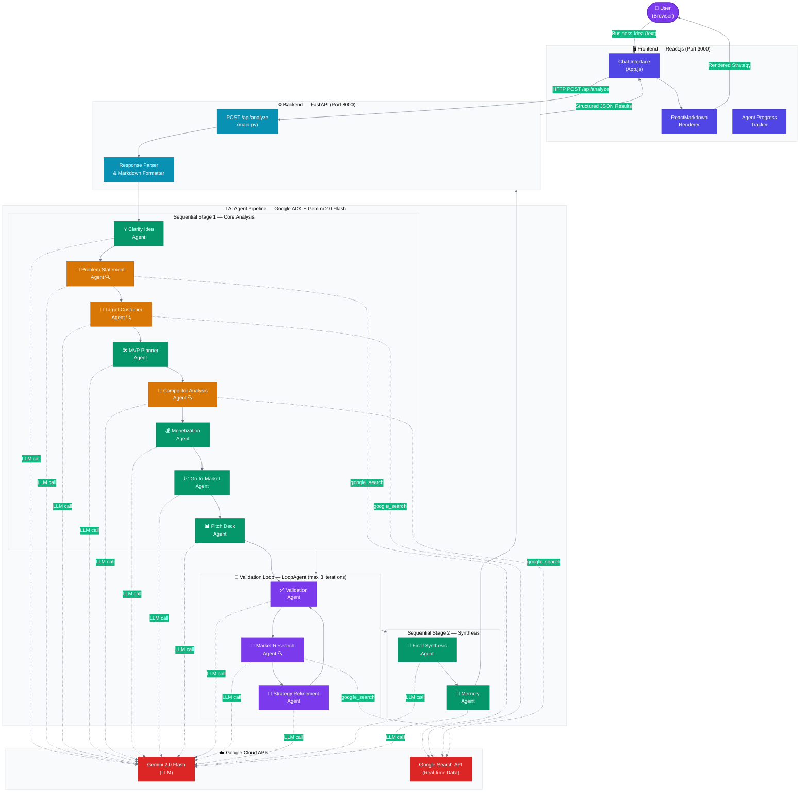

# 🚀 PitchDeck Agents — AI-Powered Startup Strategist

> Transform any raw business idea into a comprehensive, investor-ready pitch deck using a multi-agent AI pipeline powered by Google ADK and Gemini 2.0 Flash.

---

## 🧩 Problem Statement

Early-stage founders and entrepreneurs face a major bottleneck: **turning a nascent idea into structured, compelling materials that investors actually want to see**. This requires simultaneously:

- Conducting real-time market research
- Articulating a clear problem and solution
- Defining target customers and competitive landscapes
- Planning an MVP, revenue model, and go-to-market strategy
- Assembling all of the above into a coherent pitch deck

Doing this manually takes days or weeks of effort, domain expertise, and iteration. Most founders either skip critical steps or produce low-quality, inconsistent deliverables — hurting their chances of securing funding.

---

## 💡 Motivation

**PitchDeck Agents** was built to solve this problem end-to-end using AI. The core insight is that building a pitch deck is a *sequential, decomposable workflow* — each step depends on the previous one, and each step benefits from a specialized perspective.

Rather than asking a single AI model to "write a pitch deck," this system deploys **11 specialized AI agents** that each own a narrow responsibility and pass structured outputs to downstream agents. The result is a richer, more consistent, and more investor-ready strategy than any single prompt could produce.

This application is built for:
- **Founders** who need rapid idea validation and structured pitch materials
- **Accelerators & Incubators** looking to help cohorts prepare for demo days
- **Product teams** exploring new market opportunities
- **Investors** who want quick AI-generated due-diligence overviews

---

## 🏗️ System Architecture



> **Legend:**
> - 🟢 **Green agents** — Pure LLM reasoning (no external tools)
> - 🟡 **Amber agents** — LLM + Google Search (real-time market data)
> - 🟣 **Purple agents** — Iterative validation loop (run up to 3 times)
> - 🔵 **Blue** — FastAPI backend layer
> - 🔴 **Red** — Google Cloud external services

---

## ⚙️ How It Works — End-to-End

```
User Input → Frontend → FastAPI Backend → 11-Agent AI Pipeline → Structured Results → Frontend → User
```

### Step-by-Step Flow

1. **User submits a business idea** via the React chat interface (e.g., *"An AI-powered meal planning app"*).

2. **The React frontend** sends an HTTP POST request to the FastAPI backend at `POST /api/analyze`.

3. **The FastAPI backend** receives the request, passes the idea to the Google ADK agent pipeline, and waits for results.

4. **The AI pipeline runs 11 specialized agents in order:**

   | # | Agent | Tool | Output Key |
   |---|-------|------|------------|
   | 1 | 💡 Clarify Idea | — | `refined_idea` |
   | 2 | 🎯 Problem Statement | Google Search | `problem` |
   | 3 | 👥 Target Customer | Google Search | `customer` |
   | 4 | 🛠️ MVP Planner | — | `mvp` |
   | 5 | 🏢 Competitor Analysis | Google Search | `competitors` |
   | 6 | 💰 Monetization | — | `monetization` |
   | 7 | 📈 Go-to-Market | — | `gtm` |
   | 8 | 📊 Pitch Deck | — | `pitch_deck` |
   | 9 | ✅ Validation *(loop)* | — | `validation_feedback` |
   | 10 | 📡 Market Research *(loop)* | Google Search | `market_insights` |
   | 11 | 🔧 Strategy Refinement *(loop)* | — | `refined_strategy` |
   | 12 | 🎯 Final Synthesis | — | `final_strategy` |
   | 13 | 💾 Memory | — | `memory` |

   Agents 9–11 run inside a **LoopAgent** (up to 3 iterations), iteratively validating and improving the strategy before final synthesis.

5. **The backend** parses agent outputs, formats them as Markdown, and returns a structured JSON response.

6. **The React frontend** renders each agent's output as a rich Markdown card, with a live progress tracker showing which agents have completed.

---

## 🚀 Features

- **11-Agent AI Pipeline**: Each agent owns a single responsibility, enabling deep and consistent analysis
- **Iterative Refinement Loop**: Automatically validates and improves the strategy up to 3 times
- **Real-Time Market Research**: Google Search integration brings live market data into every analysis
- **Investor-Ready Output**: Structured pitch deck, executive summary, financial projections, and GTM strategy
- **Full-Stack Application**: React frontend + FastAPI backend with clean REST API
- **Rich Markdown Rendering**: All outputs rendered as formatted, readable documents

---

## 📋 Prerequisites

- Python 3.11+
- Node.js 18+ and npm
- Google API key with access to:
  - Gemini 2.0 Flash
  - Google Search API

---

## 🛠️ Installation & Setup

### 1. Clone the repository

```bash
git clone https://github.com/HarshaVardhanMannem/PitchDeck-Agents.git
cd PitchDeck-Agents
```

### 2. Backend Setup

```bash
cd backend

# Create and activate virtual environment
python -m venv venv
source venv/bin/activate  # On Windows: venv\Scripts\activate

# Install dependencies
pip install -r requirements.txt

# Configure environment variables
echo "GOOGLE_API_KEY=your_google_api_key_here" > startup_strategist/.env
```

### 3. Frontend Setup

```bash
cd ../frontend
npm install
```

---

## ▶️ Running the Application

### Start the Backend

```bash
cd backend
source venv/bin/activate
uvicorn main:app --reload --port 8000
```

The API will be available at `http://localhost:8000`.

### Start the Frontend

```bash
cd frontend
npm start
```

The application will open at `http://localhost:3000`.

---

## 📁 Project Structure

```
PitchDeck-Agents/
├── backend/
│   ├── main.py                      # FastAPI server & API endpoints
│   ├── requirements.txt             # Python dependencies
│   └── startup_strategist/
│       ├── __init__.py
│       └── agent.py                 # All 11 ADK agents & pipeline definition
└── frontend/
    ├── package.json                 # Node.js dependencies
    └── src/
        ├── App.js                   # Main React component (chat UI + result rendering)
        ├── App.css                  # Global styles
        └── index.js                 # React entry point
```

---

## 📊 Example Usage

### Input
```
"I want to build an AI-powered meal planning app"
```

### Output Includes
| Section | Description |
|---------|-------------|
| 💡 **Refined Concept** | Polished, investor-ready one-liner |
| 🎯 **Problem Analysis** | Market pain points backed by real data |
| 👥 **Target Customer** | Specific demographic and behavioral profile |
| 🛠️ **MVP Strategy** | Shippable product plan for 4–6 weeks |
| 🏢 **Competitor Analysis** | Top 3 competitors with strengths and gaps |
| 💰 **Monetization** | 2–3 validated revenue models |
| 📈 **Go-to-Market Plan** | Step-by-step plan to acquire first 100 users |
| 📊 **Pitch Deck Outline** | Full investor presentation structure |
| 🎯 **Final Strategy** | Synthesized, polished startup strategy document |

---

## 🔧 Configuration

### Environment Variables

| Variable | Description |
|----------|-------------|
| `GOOGLE_API_KEY` | Google API key for Gemini 2.0 Flash and Search |

### Agent Customization

Modify agent instructions in `backend/startup_strategist/agent.py` to:
- Adjust prompts for specific industries or geographies
- Add new tools (e.g., LinkedIn API, Crunchbase)
- Change the number of validation loop iterations (`max_iterations`)
- Add new agents to the pipeline

---

## 🚨 Troubleshooting

| Issue | Solution |
|-------|----------|
| Backend won't start | Verify `GOOGLE_API_KEY` is set in `backend/startup_strategist/.env` |
| Frontend can't reach backend | Ensure backend is running on port 8000 |
| Google Search errors | Check that your API key has Google Search API enabled |
| Import errors | Run `pip install -r requirements.txt` in the backend directory |
| Slow responses | Normal — the full pipeline makes 13+ LLM calls; expect 30–120 seconds |

---

## 📄 License

This project is licensed under the MIT License — see the [LICENSE](LICENSE) file for details.

---

 